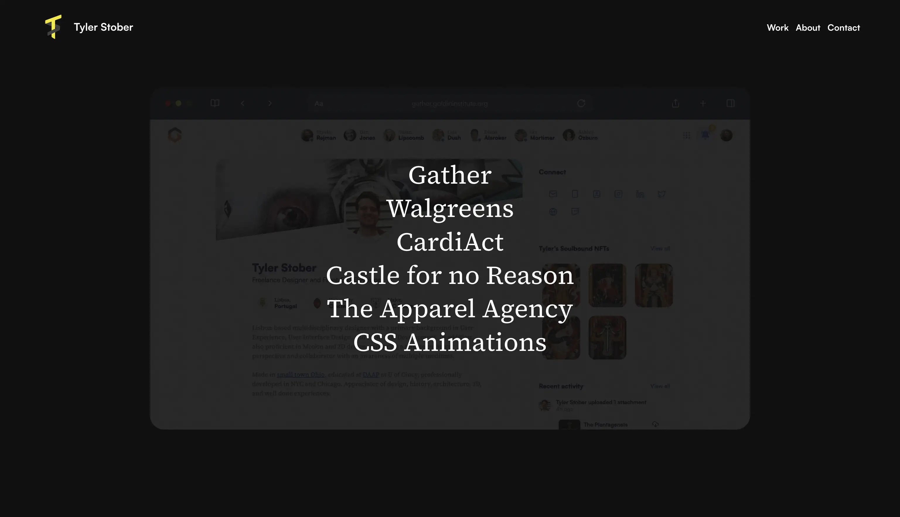

 
Thanks for visiting my Portfolio repo for www.tylerstober.com
 
Email stobertg@gmail.com for new projects and inquiries.
  
This is for viewing / observational purposes only.
 
Visit https://codepen.io/stobertg, or the repos mentioned below for front end contributions available for free use.
  
Special thanks to Keanan Koppenhaver - forever greatful for the coding mentorship
https://keanankoppenhaver.com/
  
Team members worked with:

Gather: 
 
Faraj Khasib ( back-end ) 
  
CardiAct: 
 
Geoff Burroughs - https://www.linkedin.com/in/burrougw/
  
Walgreens: 
 
Stefan Clark - http://www.stefanclark.com/
 
Ryne Estwing - http://ryneestwing.com/ 
 
Mike Pruim - https://www.mikepruim.com/ 
 
Akemi Hong - http://www.studioakemi.com/work-1

 
Credit to the third-party libraries used:
 
react-tilt: https://www.npmjs.com/package/react-parallax-tilt
 
react-easy-preload: https://www.npmjs.com/package/react-easy-preload?activeTab=readme
 
react-reveal: https://www.react-reveal.com/examples/common/custom/
 
react-count-up: https://www.npmjs.com/package/react-countup
 
react-transition-group: https://github.com/reactjs/react-transition-group
 
react-player: https://www.npmjs.com/package/react-player
